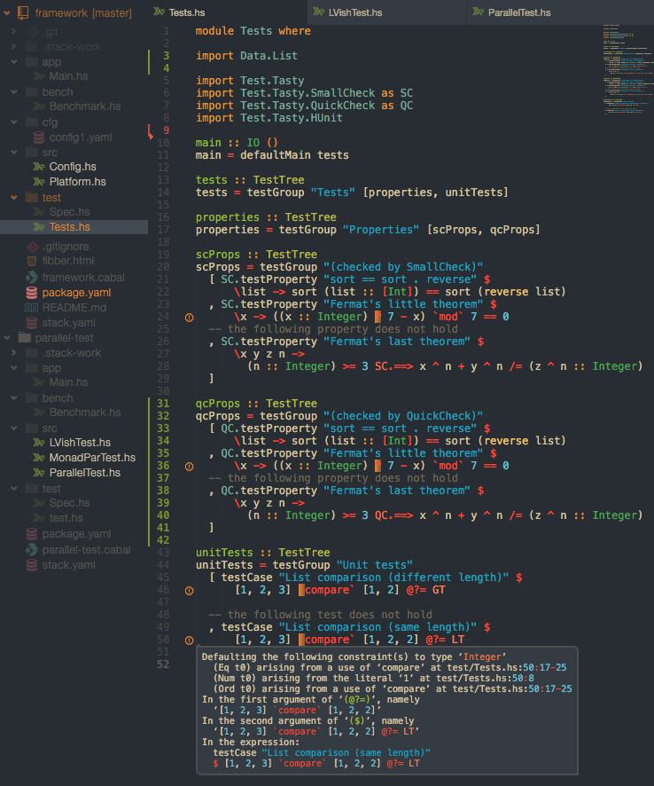

# Polymorph based Dktn Atom UI theme - polymorph-dktn-ui package

A minimal UI. Best with [gruvbox-dktn-syntax](https://github.com/dktn/gruvbox-dktn-syntax).

## Features

* Reduced frame boxes and contrast colors
* Configurable theme color
* Optionally hiding unused files keeping visible git statuses
* Changes default Haskell icon color

## Credits

* [Polymorph UI](https://atom.io/themes/polymorph-ui) - general structure and styles
* [Climate Atom Theme](https://atom.io/themes/climate-ui) - distraction free mode

#### Addons used in screenshots
* [minimap](https://atom.io/packages/minimap)
* [file-icons](https://atom.io/packages/file-icons)
* [gruvbox-dktn-syntax](https://github.com/dktn/gruvbox-dktn-syntax)
